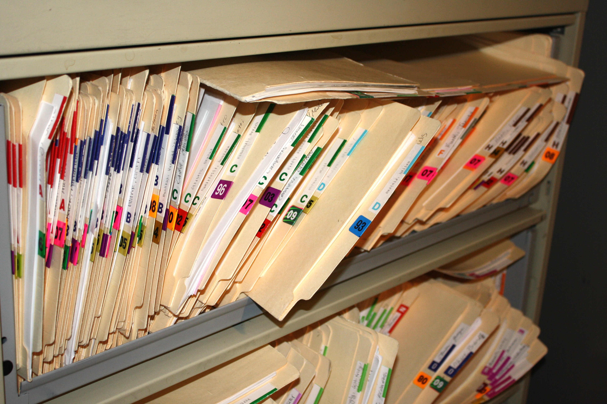

# Junk-File-Cleaner
REQUIREMENTS - colored (you can installed colored by using pip install colored)

IMPORTANT NOTE - It is best to use and run this program or script as being an administrator since one to two of the junk folders will almost always contain administror controllered files and folders that need to be cleaned. Without being an administrator, the script will only partially clean junk files and will eventually hit an error that will end the script.

DESCRIPTION - This is used as a python script that I use for my computer. This script is set to automatically run everyday at 1:30pm, once running the script will open a pre-installed cleaning program that is on every windows PC and then open two other junk folders inside of windows to clean up.

