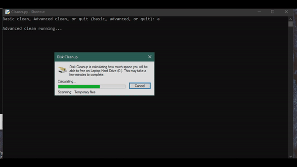

<h1 align="center">
    Junk File Cleaner 🗃️
</h1>

    
    
        
        
     
    
     
     
     
        

    

# Description 📂
- This is used as a python script that I use for my computer. This script can be set to automatically run every day at whatever time you would like or even when you start your computer and log on. Once the script is ran, it will open a pre-installed cleaning program that is on every Windows PC and then open two other junk folders inside of windows to clean up.

# Demonstration 📷

# Important ⚡
1. It is best to use and run this program or script as being an administrator since one to two of the junk folders will almost always contain administror controllered files and folders that needs to be cleaned. Without being an administrator, the script will only partially clean junk files and will eventually hit an administrator error that will end the script short.

# [Requirements](https://github.com/JordanLeich/Junk-File-Cleaner/blob/master/requirements.txt) ❗
### Option 1 (Python not installed)
1. Windows operating system
1. Download the [exe file](https://github.com/JordanLeich/Junk-File-Cleaner/blob/master/cleaner.exe) and run the file as administrator.

### Option 2 (Python not installed)
1. Windows operating system
1. Download the [batch file](https://github.com/JordanLeich/Junk-File-Cleaner/blob/master/cleaner.bat) and run the file as administrator.

### Option 3 (Python installed)
1. Windows operating system
1. Colored (you can install colored by using pip install colored) (only applies to those who are using python and not the .exe file!)
